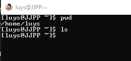

Trabajando con archivos y directorios
=====================================

## Requisitos

- Ubuntu, en una maquina virtual por ejemplo
- Linux desde windows con la virtualizacion, en mi caso tengo oracle.
- Con GitBash que es un entorno de linux para Github

## Comandos usados

- `ls` lista archivos
- `ls -l` lista archivos con mas info
- `ls -la` muestra todo, con los ocultos
- `echo` envia texto, inclusive a un archivo, 
- `cat` muestra el contenido del archivo
- `cat -n archivo.ext` muestra el contenido con las lineas
- `man` manual, ejemplo `man cat`
- `whoami` dice el nombre del usuario actual

Columnas:
1. permisos
2. grupo
3. usuario
4. tamaño
5. fecha
6. directorio

usando `man cat`

## Actividad

1 - Utiliza el comando adecuado para mostrar, en el terminal, el mensaje "Bienvenido al curso de Linux de Alura".

2 - Ahora escribe el mensaje de arriba en un archivo llamado bienvenido.txt, usando el comando que realiza esta tarea.

Aproveche la oportunidad para verificar si el archivo fue creado usando el comando ls.

Sugerencia: Recuerde que podemos navegar entre los comandos ya escritos usando las teclas de flecha hacia arriba y hacia abajo.

R:
