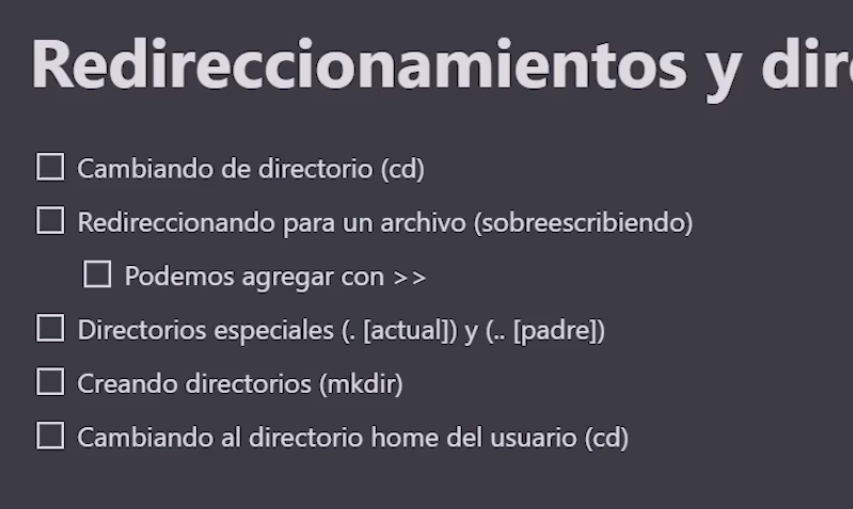

Redireccionamiento y directorios
===================================



## Agregar texto a un archivo ">>"

```bash
echo "u2" > mi_musica.txt
echo "ub40" >> mi_musica.txt
cat mi_musica.txt
u2
ub40
```

## Caracteres comodines


- `rmdir`: elimina un directorio vacío
- `rm -r`: elimina un directorio y su contenido: se debe tener cuidado con este comando, ya que no pregunta si se desea eliminar el contenido
- `rm -rf`: elimina un directorio y su contenido sin preguntar
- `rm -rf *`: elimina todo el contenido del directorio actual


```bash
mkdir eror
## ese directorio quedó mal escrito
mv eror error
## otra forma es borrarlo y volver a crearlo
rmdir eror
mkdir error
```

### Comodín `?` 

- `?` representa un solo carácter

```bash
ls -l curso?.txt
```

### Comodín `*`

- `*` representa cero o más caracteres

```bash
ls -l curso*.txt
```


