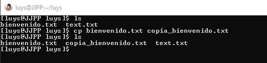
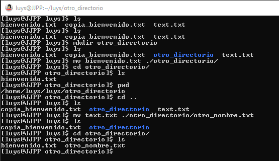
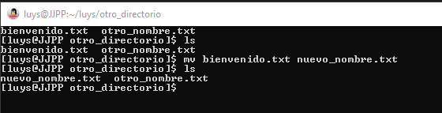

Manipulando, comprimiendo y descomprimiendo archivos
===================================================

## `cp` copiar archivos y directorios

- `cp -R`: copia un directorio y su contenido de forma recursiva

## `mv` mover archivos y directorios, también se puede usar para renombrar archivos y directorios

