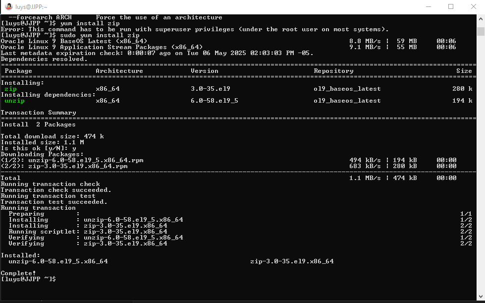
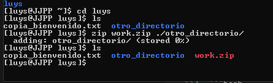
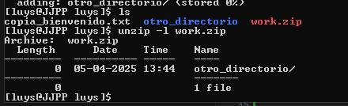
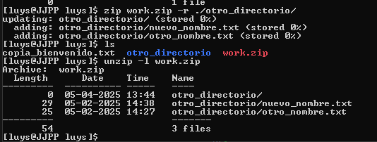

Manipulando, comprimiendo y descomprimiendo archivos
===================================================


## `cp` copiar archivos y directorios


- `cp -R`: copia un directorio y su contenido de forma recursiva


## `mv` mover archivos y directorios, también se puede usar para renombrar archivos y directorios


## Creando y abriendo ZIP


- En oracle Linux, el comando `zip` no está instalado por defecto. Para instalarlo, puedes usar el siguiente comando:

```bash
sudo yum install zip
```



- Para crear un archivo ZIP, puedes usar el siguiente comando:

```bash
zip work.zip ./otros_
```



- Para ver el contenido de un archivo ZIP, puedes usar el siguiente comando:

```bash
unzip -l work.zip
```




- pero como podemos ver no se comprimieron todos los archivos, es necesario ejecutar el comando de manera recursiva, para eso se utiliza el parámetro `-r`:

```bash
zip -r work.zip ./otros_
```



- para descomprimir un archivo ZIP, puedes usar el siguiente comando:

```bash
unzip work.zip

## silecioso
unzip -q work.zip
```

- comprimido silencioso y recursivo:

```bash
unzip -rq work.zip
```


