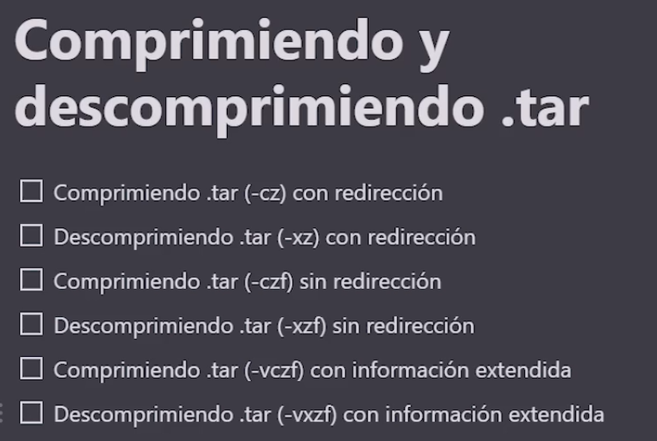
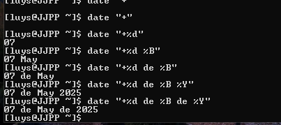

Comprimiendo y descomprimiendo tar
===================================



- En Linux, el comando `tar` se utiliza para crear y manipular archivos tar, que son archivos de archivo que pueden contener varios archivos y directorios. El nombre "tar" proviene de "tape archive", ya que originalmente se utilizaba para archivar datos en cintas magnéticas.

## Crear un archivo tar

- Para crear un archivo tar, se utiliza el comando `tar` seguido de la opción `-cvf`, que significa "crear un archivo tar" y "verbose" (para mostrar los archivos que se están agregando al archivo tar). La sintaxis básica es la siguiente:

```bash
tar -cvf nombre_archivo.tar /ruta/del/directorio

### 

tar -cz ./alura > work.tar.gz
```

- c: crear
- z: comprimir
- v: verbose (opcional, muestra el progreso)
- f: archivo (especifica el nombre del archivo tar a crear)

## Descomprimir un archivo tar

- Para descomprimir un archivo tar, se utiliza el comando `tar` seguido de la opción `-xvf`, que significa "extraer un archivo tar" y "verbose". La sintaxis básica es la siguiente:

```bash
tar -xvf nombre_archivo.tar

##

tar -xz < work.tar.gz
```

- x: extraer
- v: verbose (opcional, muestra el progreso)
- f: archivo (especifica el nombre del archivo tar a extraer)
- z: descomprimir

## Touch, Fecha de la ultima modificación y fecha del sistema


- Se usa por lo general para actualizar la fecha del archivo a la fecha del sistema, pero si el archivo no existe lo crea.

- El comando `touch` se utiliza para crear archivos vacíos o actualizar la fecha de modificación de un archivo existente. La sintaxis básica es la siguiente:

```bash
touch nombre_archivo
```

## Usando help

- El comando `help` se utiliza para obtener información sobre los comandos disponibles en la terminal de Linux. La sintaxis básica es la siguiente:

```bash
help pwd
```

en otros casos se puede colocar el nombre del comando seguido de `--help` o `-h` para obtener información sobre su uso y opciones disponibles. Por ejemplo:

```bash
tar --help
```


## Formateando la fecha

- El comando `date` se utiliza para mostrar o establecer la fecha y hora del sistema. La sintaxis básica es la siguiente:

```bash
$ date "+%d/%m/%Y"
16/07/2021
```




## Less, head y tail


- `less`: es un paginador que permite ver el contenido de un archivo de texto de forma interactiva. Permite *desplazarse hacia adelante y hacia atrás* en el archivo, buscar texto y realizar otras operaciones.

```bash
less nombre_archivo
```
- `head`: muestra las primeras líneas de un archivo. Por defecto, muestra las primeras 10 líneas, pero se puede especificar un número diferente.

```bash
head nombre_archivo
head -n 20 nombre_archivo ## n especifica el número de líneas a mostrar
```
- `tail`: muestra las últimas líneas de un archivo. Por defecto, muestra las últimas 10 líneas, pero se puede especificar un número diferente.

```bash
tail nombre_archivo
tail -n 20 nombre_archivo ## n especifica el número de líneas a mostrar
```

- `head` y `tail` son útiles para ver rápidamente el contenido de archivos grandes sin tener que abrirlos por completo. También se pueden usar con tuberías (`|`) para procesar la salida de otros comandos.

```bash
ls -l | head
```