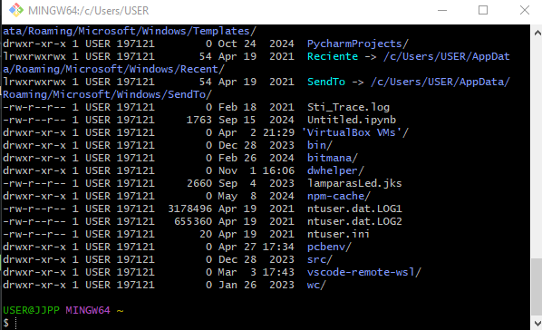

Trabajando con archivos y directorios
=====================================

## Requisitos

- Ubuntu, en una maquina virtual por ejemplo
- Linux desde windows con la virtualizacion, en mi caso tengo oracle.
- Con GitBash que es un entorno de linux para Github

## Comandos usados

- `ls` lista archivos
- `ls -l` lista archivos con mas info
- `ls -la` muestra todo, con los ocultos
- `echo` envia texto, inclusive a un archivo, 
- `cat` muestra el contenido del archivo
- `man` manual, ejemplo `man cat`

Columnas:
1. permisos
2. grupo
3. usuario
4. tamaño
5. fecha
6. directorio

usando `man cat`

